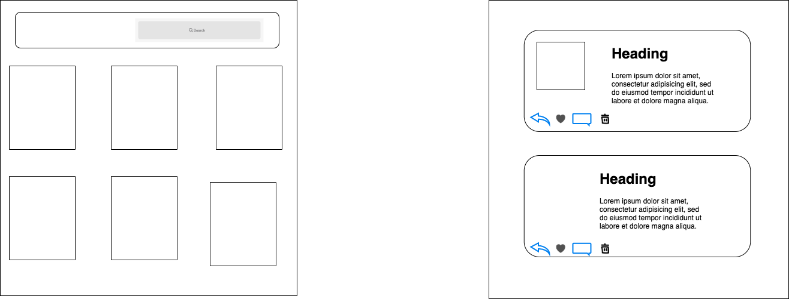

# project-2 MovieList

A Movie List with a good design made with  react for visual part and firebase to store the data and fetch ing the movis data from  moviedb API designed wth react-circular-progressbar reactstrap react-bootstrap react-drag-drawer and materializecss

## Table of Contents

* Live Project
* User Stories
* wireframe
* Features
* Built with

## Live Project
https://vex-xcc.github.io/MovieList/

## User Stories and wireframes 

*  As a user, I should be able to see the top rated movie
*  As a user, I should be able to click on movie poster to display movie Details
*  As a user, I should de able to see the movie title.
*  As a user, I should be able to search for movie 
*  As a user, I should be able to Navigate through the pages.
*  As a user, I should be able to add movie to favourite.
*  As a user, I should be able to add review to the movie.
*  As a user, I should be able to edit  the review.
*  As a user, I should be able to remove the review movie.

## wireframe  

## unsolved problem

remove all review from the database

## Features

* seach for movie .
* add review to the movie.
* edit the review.
* remove the review. 

## Built with

* react
* firebaseDatabase
* Axios
* Postman
* react-circular-progressbar
* reactstrap
* react-bootstrap
* react-drag-drawer
* materializecss

